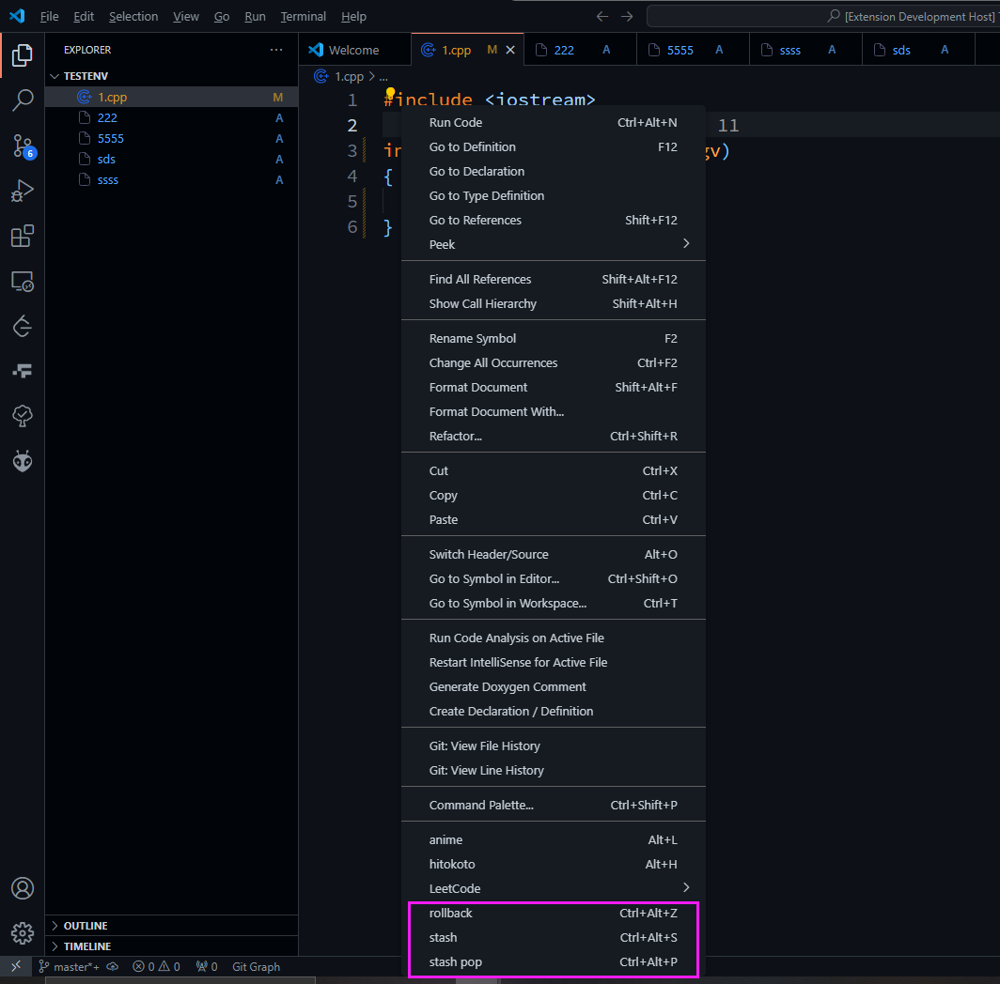

# githelper README

当你创建，删除和修改文件时，它会自动帮你完成git add操作。  
*When you create, delete or edit, it will git add automatically for you.*

## Features

-[x] 自动git add！  
-[x] 为rollback提供右键和快捷键 `ctrl` `alt` `z`  
-[x] 为stash（贮藏）和stash pop 提供右键和快捷键  
    > git stash `ctrl` `alt` `s`  
    > git stash pop `ctrl` `alt` `p`



> Tip: 

## Requirements
建议：  
|requirement|version|
| - | - |
|VsCode|1.87.0|
|Nodejs|16.20.2|

## Extension Settings

* `GitHelper.skysource2030.rollbackAutoSave`: 是否开启回滚自动保存
* `GitHelper.skysource2030.rollbackAutoSavePath`: 配置回滚自动保存路径
* `GitHelper.skysource2030.gitAutoAdd`: 是否开启自动 `git add` 功能
* `GitHelper.skysource2030.ignoreList`: 自动 `git add` 忽略操作的文件夹/文件名称

示例(这里采用的默认值)：
```json
"GitHelper.skysource2030.rollbackAutoSave": true,
"GitHelper.skysource2030.rollbackAutoSavePath": "C:\\Users\\Public\\Documents\\backup",
"GitHelper.skysource2030.gitAutoAdd": true,
"GitHelper.skysource2030.ignoreList": [".git",".vscode"],
```

## Known Issues

Calling out known issues can help limit users opening duplicate issues against your extension.

## Release Notes

### 1.0.0

初始版本  
Initial version
